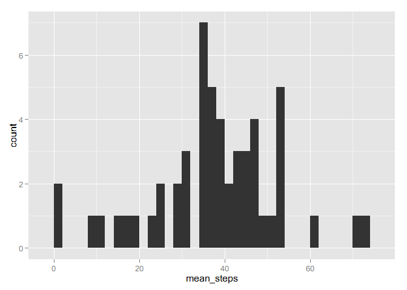
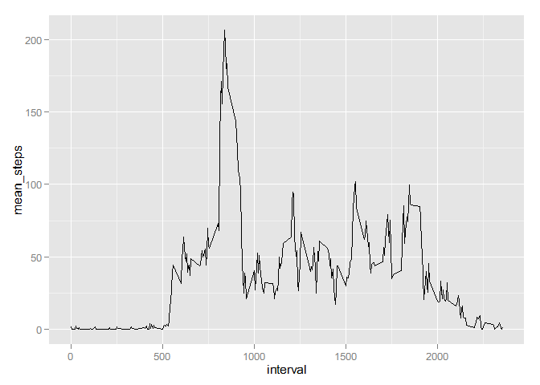
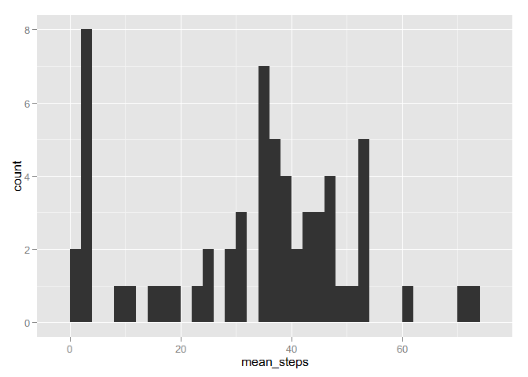
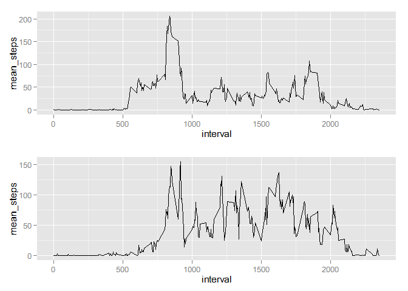

# Reproducible Research: Peer Assessment 1


## Loading and preprocessing the data

unzipping the file is nessecary

```r
file <- "activity.csv"
if(file.exists(file)==FALSE){
  zipfile <- "repdata_data_activity.zip"
  unzip(zipfile, files = NULL, list = FALSE, overwrite = TRUE,
        junkpaths = FALSE, exdir = ".", unzip = "internal",
        setTimes = FALSE)
}
```
loading the data into R


```r
if (exists("alldata")== FALSE) {
  alldata <- read.csv('activity.csv', header = TRUE)
}
```
transform the data into a dyplr format


```r
library(dplyr)
alldata <- tbl_df(alldata)
```

## What is mean total number of steps taken per day?


```r
byday <- group_by(alldata, date)
sum_day <- summarize(byday,
                      count = n(),
                      mean_steps = mean(steps, na.rm=TRUE),
                      median_steps = median(steps, na.rm = TRUE))
print(sum_day)
```

```
## Source: local data frame [61 x 4]
## 
##          date count mean_steps median_steps
## 1  2012-10-01   288        NaN           NA
## 2  2012-10-02   288    0.43750            0
## 3  2012-10-03   288   39.41667            0
## 4  2012-10-04   288   42.06944            0
## 5  2012-10-05   288   46.15972            0
## 6  2012-10-06   288   53.54167            0
## 7  2012-10-07   288   38.24653            0
## 8  2012-10-08   288        NaN           NA
## 9  2012-10-09   288   44.48264            0
## 10 2012-10-10   288   34.37500            0
## ..        ...   ...        ...          ...
```
histogram of number of steps per day 

```r
library(ggplot2)
qplot(mean_steps, data = sum_day, binwidth = 2)
```

 

## What is the average daily activity pattern?

first divided the data by interval

```r
byinterval <- group_by(alldata, interval)
sum_interval <- summarize(byinterval,
                      count = n(),
                      mean_steps = mean(steps, na.rm=TRUE),
                      median_steps = median(steps, na.rm=TRUE))
print(sum_interval)
```

```
## Source: local data frame [288 x 4]
## 
##    interval count mean_steps median_steps
## 1         0    61  1.7169811            0
## 2         5    61  0.3396226            0
## 3        10    61  0.1320755            0
## 4        15    61  0.1509434            0
## 5        20    61  0.0754717            0
## 6        25    61  2.0943396            0
## 7        30    61  0.5283019            0
## 8        35    61  0.8679245            0
## 9        40    61  0.0000000            0
## 10       45    61  1.4716981            0
## ..      ...   ...        ...          ...
```

```r
max_interval <- sum_interval$interval[which.max(sum_interval$mean_steps)]
```

plot the daily activity pattern

```r
qplot(interval, mean_steps, data = sum_interval, geom = 'line')
```

 

the maximum amount of steps is taken in interval 835

## Imputing missing values
fill in the missing data and calcute the day of the different dates.

```r
total_na <- sum(is.na(alldata$steps))
index <- which(is.na(alldata$steps))
filldata = alldata
for (i in index){
    interval <- alldata$interval[i]  
    mdn <-sum_interval$median_steps[sum_interval$interval == interval]
    filldata$steps[i] = mdn
    }

filldata$date <- as.Date(as.character(filldata$date), format = "%Y-%m-%d")
filldata$weekday <- weekdays(filldata$date)
filldata$weekend <- sub('zaterdag', 'weekend', filldata$weekday)
filldata$weekend <- sub('zondag', 'weekend', filldata$weekend)
filldata$weekend <- sub('maandag', 'week', filldata$weekend)
filldata$weekend <- sub('dinsdag', 'week', filldata$weekend)
filldata$weekend <- sub('woensdag', 'week', filldata$weekend)
filldata$weekend <- sub('donderdag', 'week', filldata$weekend)
filldata$weekend <- sub('vrijdag', 'week', filldata$weekend)
filldata$weekend <- factor(filldata$weekend)
```

summarize the data

```r
byday_fill <- group_by(filldata, date)
sum_day_fill <- summarize(byday_fill,
                      count = n(),
                      mean_steps = mean(steps, na.rm=TRUE),
                      median_steps = median(steps, na.rm = TRUE))

byinterval_fill <- group_by(filldata, interval)
sum_interval_fill <- summarize(byinterval_fill,
                      count = n(),
                      mean_steps = mean(steps, na.rm=TRUE),
                      median_steps = median(steps, na.rm = TRUE))
```

plot the data


```r
qplot(mean_steps, data = sum_day_fill, binwidth = 2)
```

 

The total number of rows with missing values is 2304. 

## Are there differences in activity patterns between weekdays and weekends?


```r
splitdata <- split(filldata, filldata$weekend)
weekdata  <- splitdata$week
weekenddata <- splitdata$weekend

byinterval_fill <- group_by(weekdata, interval)
week_sum_interval_fill <- summarize(byinterval_fill,
                      count = n(),
                      mean_steps = mean(steps, na.rm=TRUE),
                      median_steps = median(steps, na.rm = TRUE))

byinterval_fill <- group_by(weekenddata, interval)
weekend_sum_interval_fill <- summarize(byinterval_fill,
                      count = n(),
                      mean_steps = mean(steps, na.rm=TRUE),
                      median_steps = median(steps, na.rm = TRUE))
```

Make the plots and load script to put multiple plots into one panel


```r
p1 <-qplot(interval, mean_steps, data = week_sum_interval_fill, geom = 'line')
p2 <-qplot(interval, mean_steps, data = weekend_sum_interval_fill, geom = 'line')
source('multiplot.R')
multiplot(p1, p2,cols=1)
```

```
## Loading required package: grid
```

 


